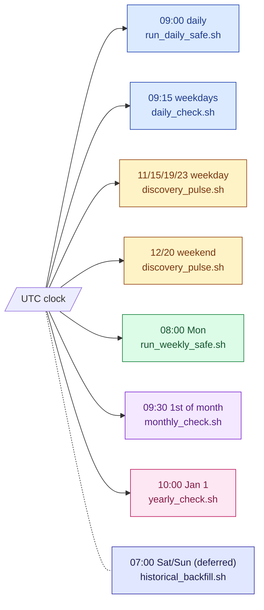
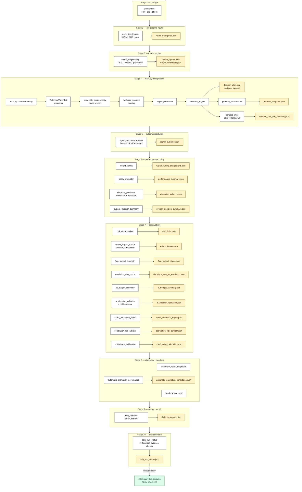
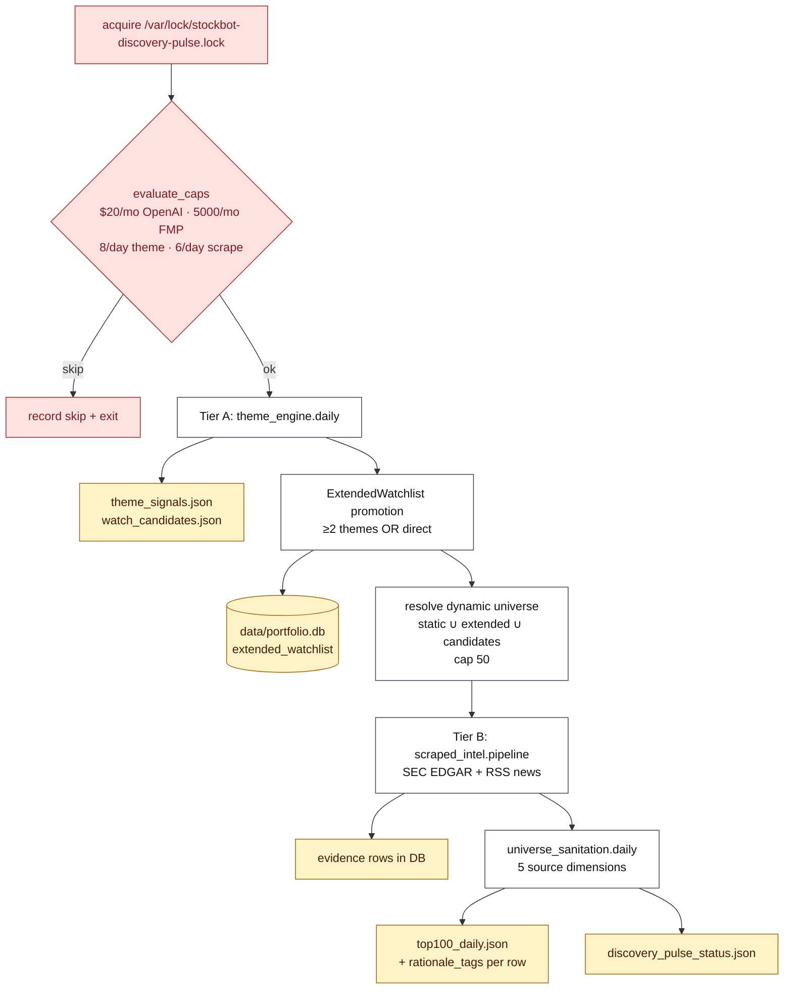
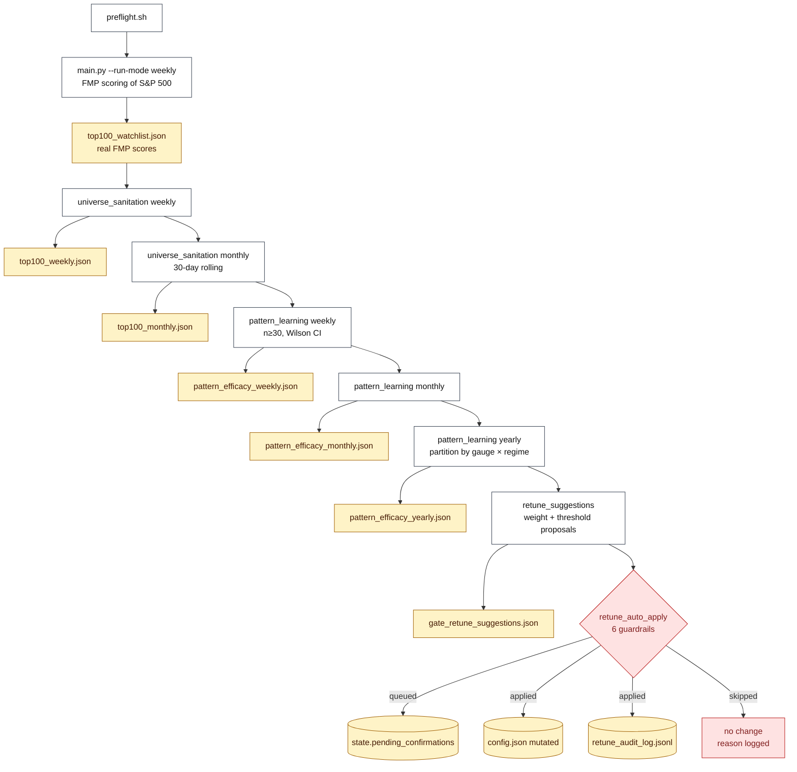
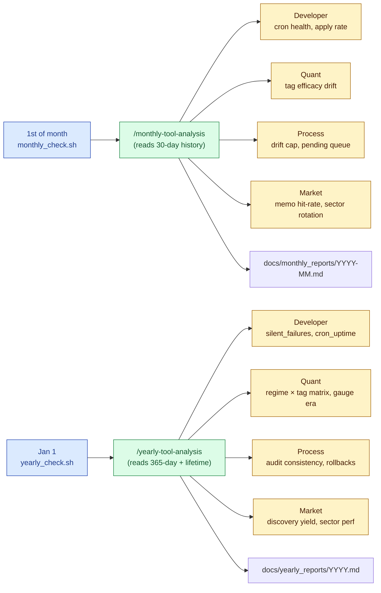
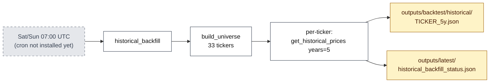
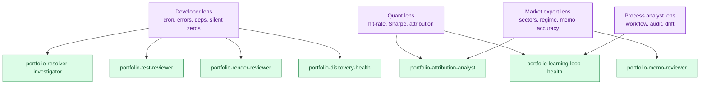
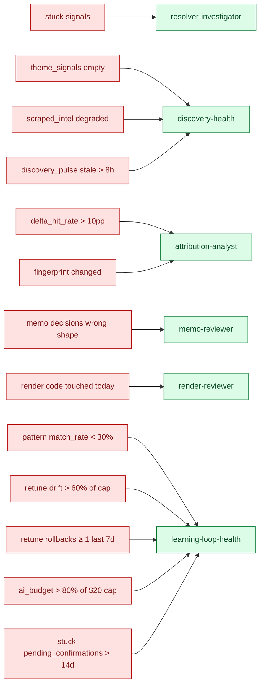

# Portfolio Automation System — Workflow + Coverage Map

**Last updated:** 2026-05-28

This document is the canonical system overview. It shows every cron-scheduled
producer in the Portfolio Automation System, the artifacts each writes, and
the analysis / agent / health-check coverage that watches each one.

Per `CLAUDE.md` "Analysis + Health Coverage Requirement": every producer
must be paired with an analysis check at the appropriate cadence (daily /
monthly / yearly), with at least one lens (developer / quant / process
analyst / market expert) owning the inspection.

---

## 1. Five operating cadences (cron map)

Lock-file contention: `discovery_pulse.sh`, `run_weekly_safe.sh`, and
`historical_backfill.sh` all share `/var/lock/stockbot-discovery-pulse.lock`
(non-blocking flock) — they can't run concurrently against FMP.

---

## 2. Daily pipeline (09:00 UTC) — the heaviest cadence

---

## 3. Discovery pulse (4×/day weekday + 2×/day weekend)

---

## 4. Weekly chain (Monday 08:00 UTC)

---

## 5. Monthly + Yearly (multi-lens retrospectives)

---

## 6. Weekend backfill (deferred, ≥2026-06-04)

---

## 7. The four analytical lenses

Every analysis check belongs to one or more of these lenses. New checks
should pick a lens explicitly per CLAUDE.md's coverage requirement.

---

## 8. Coverage matrix — every producer × agent × health check

The big table. Sorted by cadence. **An empty cell means coverage is missing
and is a debt item** per CLAUDE.md.

### Daily-cadence producers (Stage 1–10 of daily pipeline)

| Producer | Artifact (latest) | Liveness check | Dispatched agent (daily) |
|---|---|---|---|
| `preflight.sh` | — (logs only) | log scan | resolver-investigator (on RED) |
| `news_intelligence` | `news_intelligence.json` | `news_intelligence.article_count_raw` | discovery-health |
| `theme_engine.daily` | `theme_signals.json`, `watch_candidates.json` | `theme_signals.themes` | discovery-health |
| `ExtendedWatchlist.evaluate_candidates` | `extended_watchlist` DB | (inferred via discovery-health DB query) | discovery-health |
| `candidate_scanner.daily` | `top100_watchlist.json` mtime check | (via scraped_intel.degraded_mode warn) | discovery-health |
| `watchlist_scanner` | `candidates_top20.csv` | — | memo-reviewer (indirect) |
| `decision_engine` | `decision_plan.json`, `.md` | (required-artifact freshness check) | memo-reviewer, attribution-analyst |
| `portfolio_construction` | `portfolio_snapshot.json` | (required-artifact freshness check) | memo-reviewer |
| `scraped_intel.pipeline` | `scraped_intel_run_summary.json` | `scraped_intel.degraded_mode` | discovery-health |
| `signal_outcomes` resolver | `signal_outcomes.csv` | (via resolution_due_probe.stuck_count) | resolver-investigator |
| `weight_tuning` | `weight_tuning_suggestions.json` | — | (none — debt) |
| `policy_evaluator` | `performance_summary.json` | — | (none — debt) |
| `allocation_preview/sim/activation` | `allocation_policy_*.json` | — | (none — debt) |
| `system_decision_summary` | `system_decision_summary.json` | (required-artifact freshness check) | memo-reviewer |
| `risk_delta_advisor` | `risk_delta.json` | (required-artifact freshness check) | resolver-investigator |
| `retune_impact_tracker` | `retune_impact.json` (+ sector_composition) | (via attribution-analyst dispatch) | **attribution-analyst** |
| `fmp_budget_telemetry` | `fmp_budget_status.json` | (via budget.status field) | discovery-health |
| `resolution_due_probe` | `decisions_due_for_resolution.json` | `stuck_count` threshold | resolver-investigator |
| `ai_budget_summary` | `ai_budget_summary.json` | `ai_budget.event_count` | discovery-health |
| `ai_decision_validator` | `ai_decision_validation.json` (LLM enhanced) | — | memo-reviewer (indirect) |
| `alpha_attribution_report` | `alpha_attribution_report.json` | — | (none — debt) |
| `correlation_risk_advisor` | `correlation_risk_advisor.json` | — | (none — debt) |
| `confidence_calibration` | `confidence_calibration.json` | — | (none — debt) |
| `automatic_promotion_governance` | `automatic_promotion_candidates.json` | — | discovery-health (indirect) |
| `daily_memo + email_sender` | `daily_memo.md`, `daily_memo.txt` | (required-artifact freshness) | **memo-reviewer (ALWAYS)** |
| `daily_run_status` | `daily_run_status.json` (8 liveness checks inside) | **self** | resolver-investigator |

### Discovery-pulse cadence (4×/day weekday + 2×/day weekend)

| Producer | Artifact (latest) | Liveness check | Dispatched agent |
|---|---|---|---|
| `discovery_pulse` orchestrator | `discovery_pulse_status.json` | `discovery_pulse.last_run_age`, `discovery_pulse.monthly_cap_status` | discovery-health |
| Tier A: `theme_engine + promotion` | (overwrites `theme_signals.json`) | `theme_signals.themes` | discovery-health |
| Tier B: `scraped_intel` over dynamic union | (DB writes) | `scraped_intel.degraded_mode` | discovery-health |
| Final: `universe_sanitation.daily` | `top100_daily.json` (+ rationale_tags) | `universe_sanitation.top100_daily` | discovery-health |

### Weekly cadence (Monday 08:00 UTC)

| Producer | Artifact | Liveness check | Dispatched agent |
|---|---|---|---|
| `main.py --run-mode weekly` (FMP scoring) | `top100_watchlist.json` (real scores) | (via scraped_intel.degraded_mode clear) | discovery-health |
| `universe_sanitation` weekly | `top100_weekly.json` | (via daily check on top100_daily) | discovery-health |
| `universe_sanitation` monthly | `top100_monthly.json` | (consumed by monthly-tool-analysis) | (monthly cadence) |
| `pattern_learning` weekly | `pattern_efficacy_weekly.json` | (via match_rate in monthly check) | **learning-loop-health** |
| `pattern_learning` monthly | `pattern_efficacy_monthly.json` | — | **learning-loop-health** |
| `pattern_learning` yearly | `pattern_efficacy_yearly.json` (partitioned) | — | (yearly cadence) |
| `retune_suggestions` | `gate_retune_suggestions.json` | (`auto_applicable_count` threshold) | **learning-loop-health** |
| `retune_auto_apply` | `retune_audit_log.jsonl`, config.json mutation | (drift cap + rollback rate) | **learning-loop-health** |

### Weekend cadence (deferred; activation ≥2026-06-04)

| Producer | Artifact | Liveness check | Dispatched agent |
|---|---|---|---|
| `historical_backfill` | `outputs/backtest/historical/*_5y.json`, `historical_backfill_status.json` | `historical_backfill.last_run` | discovery-health |

### Monthly retrospective cadence (1st of month 09:30 UTC)

| Producer | Artifact | Inputs |
|---|---|---|
| `/monthly-tool-analysis` skill | `docs/monthly_reports/YYYY-MM.md` | pattern_efficacy_monthly + audit log + 30d archives |
| Always-dispatched: `portfolio-doc-writer` | `.agent/project_state.yaml` (roadmap touch) | the month's shipped features |
| Threshold: `portfolio-learning-loop-health` | (audit) | rollback ratio, drift cap, tag drift |
| Threshold: `portfolio-attribution-analyst` | (audit) | fingerprint changes, memo hit-rate dip |
| Threshold: `portfolio-memo-reviewer` | (audit) | memo decision quality |
| Threshold: `portfolio-discovery-health` | (audit) | discovery yield, pulse skip rate |

### Yearly retrospective cadence (Jan 1 10:00 UTC)

| Producer | Artifact | Inputs |
|---|---|---|
| `/yearly-tool-analysis` skill | `docs/yearly_reports/YYYY.md` | 12 monthly reports + pattern_efficacy_yearly + lifetime audit |
| Always-dispatched: `portfolio-attribution-analyst` | (audit) | lifetime tag × regime matrix |
| Always-dispatched: `portfolio-learning-loop-health` | (audit) | audit log consistency, rollback clusters |
| Always-dispatched: `portfolio-architect` | `.agent/project_state.yaml` update | next year's roadmap, debt items |
| Always-dispatched: `portfolio-doc-writer` | architecture + decision_engine docs touch | major shifts |
| Threshold: `portfolio-discovery-health` | (audit) | discovery yield funnel < 5% |
| Threshold: `portfolio-memo-reviewer` | (audit) | memo lifetime hit-rate < 0.55 |

---

## 9. Quick reference — if X is broken, who fires?

---

## 10. Coverage debt (producers without dedicated analysis)

Per CLAUDE.md "every artifact must have a consumer at the right cadence,"
these producers currently lack a dedicated daily-tier check. They have
no urgent risk because each is observe-only and writes to LATEST only,
but they're debt-tracked here:

- `weight_tuning` → `weight_tuning_suggestions.json`
- `policy_evaluator` → `performance_summary.json`
- `allocation_preview / simulation / activation` → `allocation_policy_*.json`
- `alpha_attribution_report` → `alpha_attribution_report.json`
- `correlation_risk_advisor` → `correlation_risk_advisor.json`
- `confidence_calibration` → `confidence_calibration.json`
- `ai_decision_validator` (only indirectly covered via memo-reviewer)

**Resolution path:** add a `daily_run_status` content_liveness check
for each, OR explicitly accept the debt with a comment in the producer
module noting why (e.g., "advisory metric only; operator reviews via
GUI, no agent needed").

---

## 11. Source-of-truth files

- `CLAUDE.md` — Analysis + Health Coverage Requirement (the rule)
- `.agent/project_state.yaml` — roadmap + deferred steps
- `.claude/commands/{daily,monthly,yearly}-tool-analysis.md` — the three tier skills
- `.claude/agents/portfolio-*.md` — the 9 analysis agents
- `portfolio_automation/daily_run_status.py` — content_liveness scanner (8 checks today)
- `scripts/{run_daily_safe,daily_check,discovery_pulse,run_weekly_safe,monthly_check,yearly_check,historical_backfill}.sh` — cron entrypoints
- `crontab -l` — production schedule (7 active + 1 deferred entry)

---

_Generated 2026-05-28. Update this file whenever a new producer or
analysis check is added (per CLAUDE.md coverage rule)._
